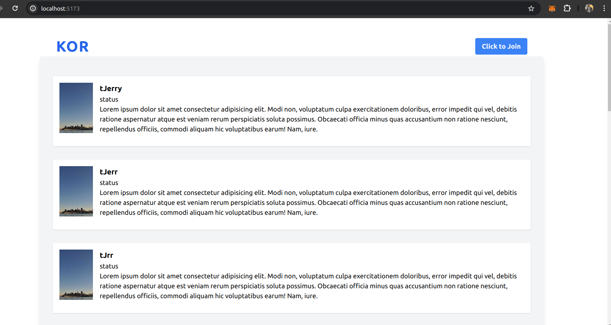
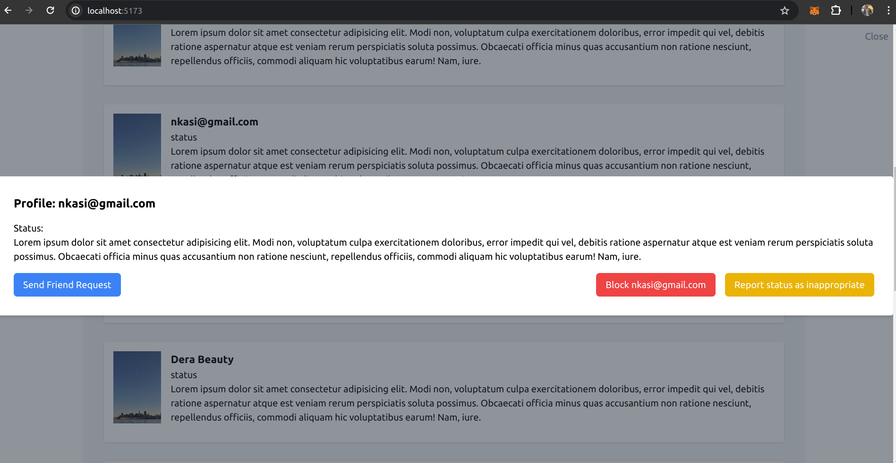
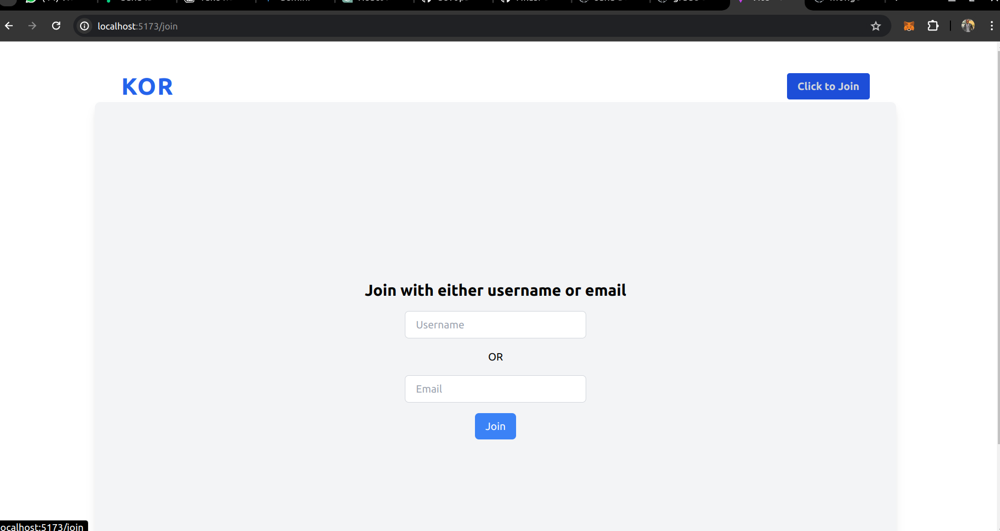
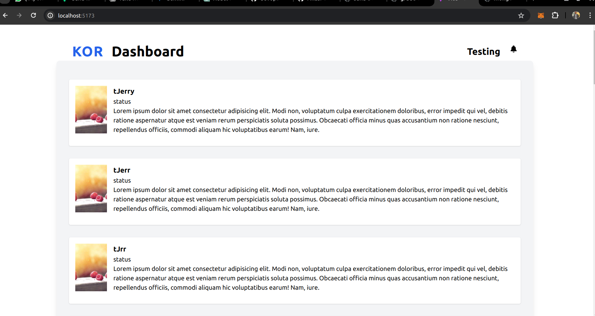
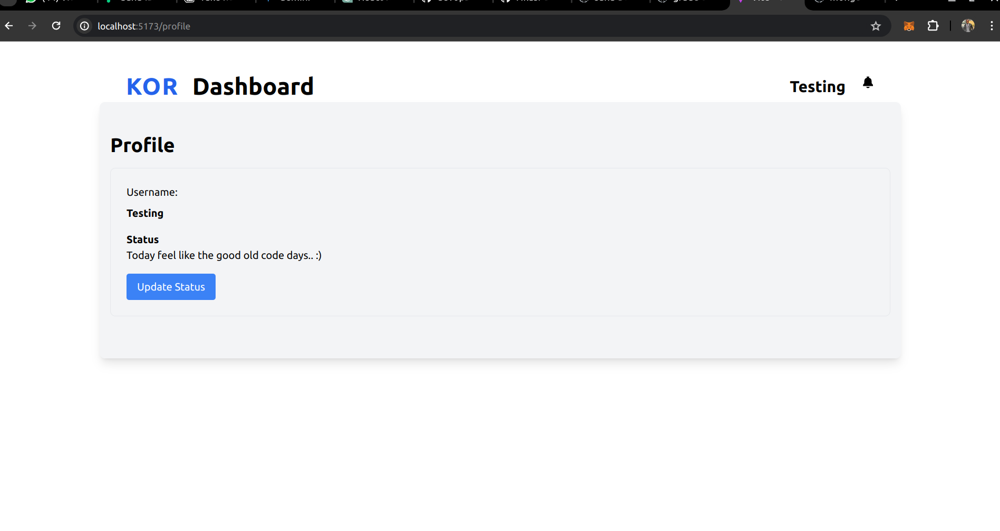

# Friend Connection

## _Overview_

To Develop a "Friend Connection" application that allows users to connect with friends,
send and receive friend requests, and get live updates on friends' statuses.

### _Tools and Technogolies used for development_

**Server Side (Backend)**:

- Typescript
- Express
- MongoDB

**Client Side (Frontend)**:

- Typescript
- Reactjs
- Redux and Redux Toolkit for state management
- Tailwind CSS for styling

**Code Versioning and Deployment**:

- Git & Github
- Docker

## Features

Below are the list of available implemented features

- [x] Anyone can read all the post available on the platform.
- [x] A user can join the platform with a unique identifier (username or email).
- [x] Users can update their status on the platform after joining
- [x] Users on the platform can request for connection by sending friend requests
- [x] Users on the platform can accept or decline friend requests from peers
- [x] Users on the platform can click on a post to view the profile of the person who owns the post
- [x] When a friend request is sent to a peer, they get notified of the request on their profile
- [x] When a request is accepted, the sender get notified of this event
- [x] When request is declined by a peer, it gets deleted from the server so as to allow for future connections and no notification is sent for this action.
- [x] Users can view their profile on their dashboad
- [x] User can view their notifations when then click on the not icon
- [x] Users can reports peers status content when they see it inappriopriate
- [x] Users can read friends posts
- [x] Users can block peers when they see it fit
- [x] Peers get notified with socket events when they receive a connection request (Only implemented on the server side)
<!-- - Note: The unchecked box means those particular feature are not ready yet but still under production or building.
- More features may still be added to the `Diary API` as an update, until it is fully ready. -->

### Assumptions

My assumptions primarily revolve around the user experience. I presumed that to engage in actions such as sending friend requests or reporting posts, users must first register or join the platform to establish a record for them. Additionally, in the absence of authentication mechanisms, I opted to remember users by storing their data in local storage, given the absence of token-based authentication.
Another assumption pertained to the schema design concerning how user statuses are managed. I assumed that users can update their status without creating a new entry, leading to the inclusion of a status field within the user document. However, I acknowledge that this approach may not be the most efficient, as it tightly couples the schema and reduces flexibility in status-related operations. A more efficient approach, in my opinion, would involve separating the user and status models into distinct entities that reference each other. This would enhance flexibility and independence between the status and user entities.

## API Documentation

### _Backend_

**API documentation**:

## Models (Document) <br>

### Users

| Field         | Validation | Constraint  | Data Type                     |
| ------------- | ---------- | ----------- | ----------------------------- |
| id            | -          | Primary Key | ObjectId                      |
| username      | -          | -           | String                        |
| email         | -          | -           | String                        |
| status        | -          | -           | String                        |
| friends       | -          | -           | Array of ObjectId (ref: user) |
| blocked_users | -          | -           | Array of ObjectId (ref: user) |
| report_count  | -          | -           | Number                        |
| reported_by   | -          | -           | Array of ObjectId (ref: user) |
| created_at    | -          | -           | Date                          |
| updated_at    | -          | -           | Date                          |

### Friend Request

| Field       | Validation                                  | Constraint          | Data Type            |
| ----------- | ------------------------------------------- | ------------------- | -------------------- |
| id          | -                                           | Primary Key         | ObjectId             |
| sender_id   | Required                                    | Reference to "user" | ObjectId (ref: user) |
| receiver_id | Required                                    | Reference to "user" | ObjectId (ref: user) |
| status      | Required, Enum: pending, accepted, declined | -                   | String               |
| created_at  | -                                           | -                   | Date                 |
| updated_at  | -                                           | -                   | Date                 |

### Notification

| Field       | Validation                                                                                      | Constraint                     | Data Type                       |
| ----------- | ----------------------------------------------------------------------------------------------- | ------------------------------ | ------------------------------- |
| id          | -                                                                                               | Primary Key                    | ObjectId                        |
| receiver_id | Required                                                                                        | Reference to "user"            | ObjectId (ref: user)            |
| request_id  | Required                                                                                        | Reference to "friend_requests" | ObjectId (ref: friend_requests) |
| message     | Required                                                                                        | -                              | String                          |
| type        | Required, Enum: friend_request, friend_request_accepted, friend_request_rejected, status_update | -                              | String                          |
| created_at  | -                                                                                               | -                              | Date                            |
| updated_at  | -                                                                                               | -                              | Date                            |

## API Endpoints

### Home Page

- Route: /v1/ping
- Method: GET
- Header
  - Authorization: None
- Response: Success

```json
{
  "ok": true,
  "environment": "development",
  "msg": "Pong"
}
```

### User Signup <br>

- Route: /v1/auth/signup
- Method: POST
- Header
  - Authorization: None

**Note**: You either sign up with email or a unique username

- Body:

```json
{
  "email": "johndoe@gmail.com"
}
```

- Responses: Success

```json
{
  "code": 201,
  "status": "ok",
  "data": {
    "email": "johndoe@gmail.com",
    "status": null,
    "friends": [],
    "blocked_users": [],
    "report_count": 0,
    "reported_by": [],
    "_id": "661e77248ebad530f54f1416",
    "createdAt": "2024-04-16T13:03:33.006Z",
    "updatedAt": "2024-04-16T13:03:33.006Z",
    "__v": 0
  }
}
```

- Throws a duplicate error when you try signing up with same payload

```json
{
  "code": 409,
  "error": "CONFLICT_REQUEST_ERROR",
  "status": "error",
  "msg": "User with johndoe@gmail.com already exists"
}
```

- Sign up with username
- Body:

```json
{
  "username": "Johndoe"
}
```

- Response

```json
{
  "code": 201,
  "status": "ok",
  "data": {
    "username": "Johndoe",
    "email": null,
    "status": null,
    "friends": [],
    "blocked_users": [],
    "report_count": 0,
    "reported_by": [],
    "_id": "661e78528ebad530f54f141a",
    "createdAt": "2024-04-16T13:08:34.220Z",
    "updatedAt": "2024-04-16T13:08:34.220Z",
    "__v": 0
  }
}
```

### Get Users

- Route: /v1/users
- Method: GET
- Body:

- Responses: Success

```json
{
  "code": 200,
  "status": "ok",
  "data": [
    {
      "_id": "661e78528ebad530f54f141a",
      "username": "Johndoe",
      "email": null,
      "status": null,
      "friends": [],
      "blocked_users": [],
      "report_count": 0,
      "reported_by": [],
      "createdAt": "2024-04-16T13:08:34.220Z",
      "updatedAt": "2024-04-16T13:08:34.220Z",
      "__v": 0
    },
    {
      "_id": "661e77248ebad530f54f1416",
      "email": "johndoe@gmail.com",
      "status": null,
      "friends": [],
      "blocked_users": [],
      "report_count": 0,
      "reported_by": [],
      "createdAt": "2024-04-16T13:03:33.006Z",
      "updatedAt": "2024-04-16T13:03:33.006Z",
      "__v": 0
    },
    {
      "friends": [],
      "blocked_users": [],
      "report_count": 0,
      "reported_by": [],
      "_id": "661c009b7ace2f00a7cb0216",
      "username": "tJrr",
      "email": null,
      "status": null,
      "createdAt": "2024-04-14T16:13:15.595Z",
      "updatedAt": "2024-04-14T16:13:15.595Z",
      "__v": 0
    },
    {
      "blocked_users": [],
      "report_count": 0,
      "reported_by": [],
      "_id": "661d4962cc6eff6ccebadf38",
      "username": "test",
      "email": null,
      "status": null,
      "friends": [],
      "createdAt": "2024-04-15T15:36:02.343Z",
      "updatedAt": "2024-04-15T15:36:02.343Z",
      "__v": 0
    }
  ]
}
```

### Get User Profile

- Route: /v1/users/profile
- Method: GET
- Header
  - Authorization: None
- Body:

- Response: Success

```json
{
  "code": 200,
  "status": "ok",
  "data": {
    "username": "Johndoe",
    "email": null,
    "status": null,
    "friends": [],
    "blocked_users": [],
    "report_count": 0,
    "reported_by": [],
    "_id": "661e78528ebad530f54f141a",
    "createdAt": "2024-04-16T13:08:34.220Z",
    "updatedAt": "2024-04-16T13:08:34.220Z",
    "__v": 0
  }
}
```

### Get User By their ID

- Route: /v1/users/661e77248ebad530f54f1416
- Method: GET
- Header
  - Authorization: None
- Body:

```json
{
  "code": 200,
  "status": "ok",
  "data": {
    "email": "johndoe@gmail.com",
    "status": null,
    "friends": [],
    "blocked_users": [],
    "report_count": 0,
    "reported_by": [],
    "_id": "661e77248ebad530f54f1416",
    "createdAt": "2024-04-16T13:03:33.006Z",
    "updatedAt": "2024-04-16T13:03:33.006Z",
    "__v": 0
  }
}
```

### Get Notification Belonging to a user via the user Id

- Route: /v1/users/661e77248ebad530f54f1416/notifications
- Method: GET
- Header
  - Authorization: None
- Body:

- Response: success

```json
{
  "code": 200,
  "status": "ok",
  "data": [
    {
      "_id": "661dc8c91f3dcf4011220eea",
      "receiver_id": "661d4962cc6eff6ccebadf38",
      "request_id": "661dc8c91f3dcf4011220ee8",
      "message": "You have a new friend request from JohnDoe",
      "type": "friend_request",
      "createdAt": "2024-04-16T00:39:37.311Z",
      "updatedAt": "2024-04-16T00:39:37.311Z",
      "__v": 0
    }
  ]
}
```

### Block a user

**Note**: The id on the url belongs to the user performing the block actions while the other id sent as a payload on the body of the request belongs to the user who is getting block

- Route: /v1/users/661e77248ebad530f54f1416/block
- Method: PATCH
- Header

  - Authorization: None

- Body:

```json
{
  "blockedUserId": "661d4b6dcc6eff6ccebadf47"
}
```

- Response: Success

```json
{
  "code": 200,
  "status": "ok",
  "data": "User blocked successfully"
}
```

### Report a User status or content

The same applies to reporting a user content, the ID of the user making the report is passed on the route url parameter

- Route: /v1/users/661e77248ebad530f54f1416/report
- Method: PATCH
- Header

  - Authorization: None

- Body:

```json
{
  "reportUserId": "661d4b6dcc6eff6ccebadf47"
}
```

- Response: Success

```json
{
  "code": 200,
  "status": "ok",
  "data": "User content reported successfully"
}
```

### Send friend request

- Route: /v1/friend-request
- Method: POST
- Header

  - Authorization: None

- Body:

```json
{
  "sender_id": "661c008b7ace2f00a7cb0210",
  "receiver_id": "661d4bc2cc6eff6ccebadf4c"
}
```

- Response: success

```json
{
  "code": 201,
  "status": "ok",
  "data": "Friend request sent successfully"
}
```

### Accept Friend Request

**Note**: The request id is the friend request that was sent, when a friend request was sent it created a data on the friends model with a default pending state

- Route: /v1/friend-request/661e8bdf80656a9443e98fc9/accept
- Method: POST
- Header

  - Authorization: None

- Body:

- Response: success

```json
{
  "code": 200,
  "status": "ok",
  "data": "Friend request accepted successfully"
}
```

### Decline Request

- Route: /v1/friend-request/661e8bdf80656a9443e98fc9/decline
- Method: POST
- Header

  - Authorization: None

- Body:

- Response: success

```json
{
  "code": 200,
  "status": "ok",
  "data": "Friend request rejected"
}
```

**Below is a User Payload with the complete resources**

```json
{
  "code": 200,
  "status": "ok",
  "data": {
    "_id": "661d4bc2cc6eff6ccebadf4c",
    "username": "Trial",
    "email": null,
    "status": "Todo list of tomorrow",
    "friends": [
      {
        "_id": "661c008b7ace2f00a7cb0210",
        "username": "tJerry",
        "email": null
      }
    ],
    "createdAt": "2024-04-15T15:46:10.392Z",
    "updatedAt": "2024-04-16T14:39:11.705Z",
    "__v": 1,
    "blocked_users": [
      {
        "_id": "661c008b7ace2f00a7cb0210",
        "username": "tJerry",
        "email": null
      },
      {
        "_id": "661e77248ebad530f54f1416",
        "email": "johndoe@gmail.com"
      }
    ],
    "report_count": 1,
    "reported_by": [
      {
        "_id": "661d24e6ee41b93bfeb5d9a5",
        "email": "nkasi@gmail.com"
      }
    ]
  }
}
```

## Client side Doc (Frontend)

Below are the visuals of the client side build with react and typescript, using redux and redux toolkit for state management and tailwind for styling







## Getting Started To Set and Run locally

### Prerequisites

In order to run this project locally, you would need to have the following installed on your local machine.

- node ^18.10,
- MongoDB
- Docker - optional

### Installation

- Clone this repository

```
git clone [https://github.com/Nkasi-e/kor-task.git]
```

- **Setting up the client app**
  After successful installation and cloning, to run the client app

- `cd into kor-task and then cd into the client folder inside it`
- Download all dependencies using the command `npm install`, when npm finish installing
- run the command `npm run dev`

- **Setting up the server**
- `cd into kor-task and then cd into the server folder inside it`
- Download all dependencies using the command `npm install`, when npm finish installing
- run the command `npm run dev`

**complete walkthrough**

```bash
# FOR THE CLIENT SIDE
cd kor-task
cd client
npm install
npm run dev

# FOR SERVER
cd kor-task
cd server
npm install
npm run dev
```

### _Setting up with docker (optional)_

```bash
# on your parent kor-task directory run the command to build and spin up a container

docker compose build up -d

# Add the -d to run in detached mode

```

## Thank You!
